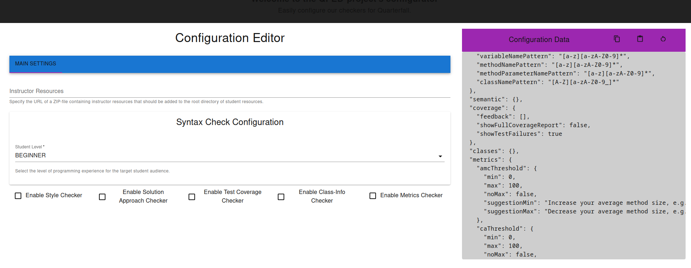
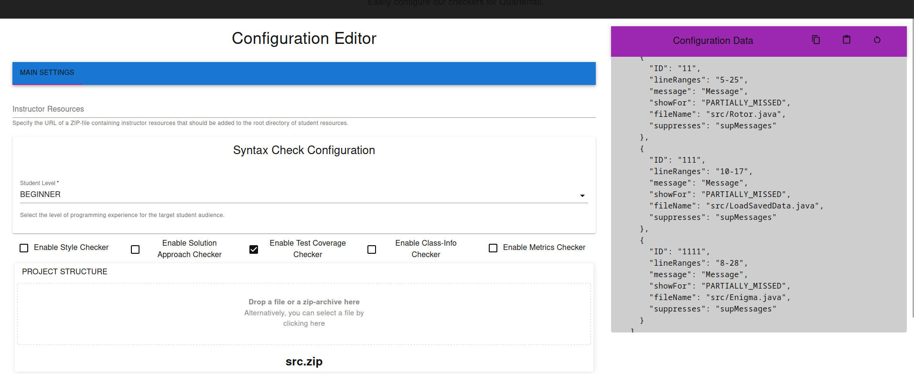
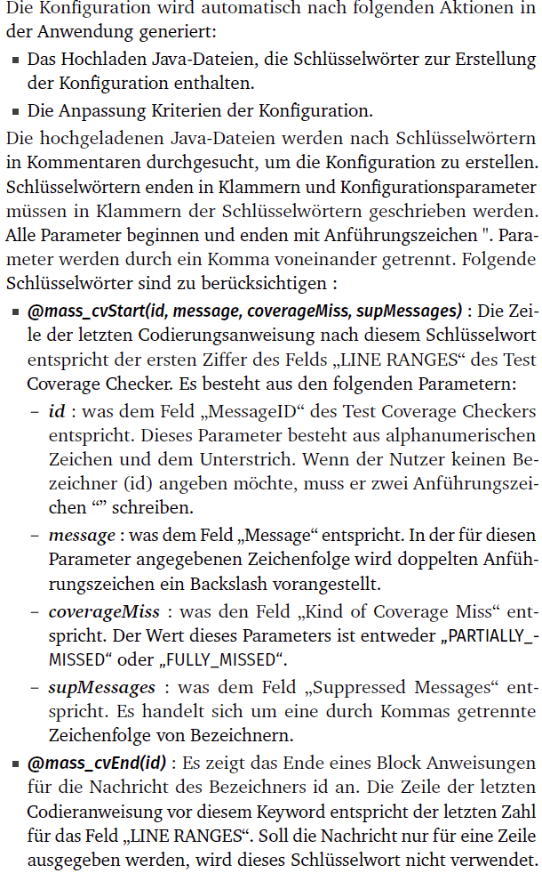

# qped.github.io (WIP)
Alle erforderlichen Funktionen aus dem Test-Coverage-Checker-Autoconfig-Repository wurden in dieses Repository integriert.  

Wie Sie sehen können, wird das Hochladen der ZIP-Datei erst dann ermöglicht, wenn der Testabdeckungsprüfer aktiviert ist.

 Erst dann können Sie eine ZIP-Datei hochladen und die Konfiguration automatisch generieren lassen.

Die Ergebnisse der JSON-Formulare und der Autoconfig werden kombiniert und rechts angezeigt. Um dies zu testen, befindet sich eine ZIP-Datei namens "src.zip" im öffentlichen Ordner, die verschiedene Java-Dateien enthält, von denen drei erwähnt werden.

