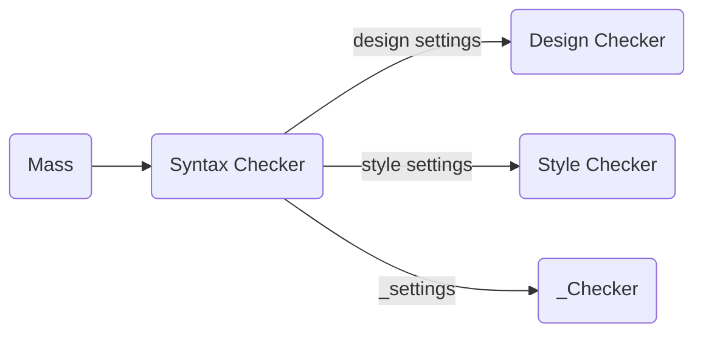

# Design Checker Tutorial

This is a quick exemplary tutorial for setting up the design settings in order to use **QPED**'s Design Checker in **Quarterfall**.

## Table of Contents
1. [General Information](#general-information)
2. [Used Example](#used-example)
   1. [Class Bag.java](#class-bag.java)
   2. [Class Mapper.java](#class-mapper.java)
3. [Create The Design Settings File](#create-the-design-settings-file)
   1. [Settings We Want To Use](#settings-we-want-to-use)
   2. [Build The JSON File](#build-the-json-file)
      1. [Manually](#manually)
      2. [From Website](#from-website)
4.  [Enable The Design Checker](#enable-the-design-checker)
5. [Submit to Quarterfall](#submit-to-quarterfall)
6. [Generated Feedback](#generated-feedback)

## <a name="general-information"></a>General Information
The Design Checker is a sub-component to a Mass Checker that is able to execute all kinds of checkers (e.g. checkers for syntax, style, semantic, class, test):


The Design Checker's main task is to check classes for their class design metrics. To generate feedback for these kinds of metrics, a configuration for every lower and upper threshold of a metric is necessary. If a threshold is not set, a default one will be used. For the checker to work properly, the configuration has to be submitted as a `.json` file.

## <a name="used-example"></a>Used Example
As an example, we will be using a project containing two different classes:

### <a name="class-bag.java"></a>Class `Bag.java`
```java
package qf.tutorials.design;
  
public class Bag {  
 
	private String price;  
	public void setPrice(String price) {  
		this.price = price;  
	}  
  
	public int calcRec(int rec) {  
		if (rec <= 0) return 1;  
		else return calcRec(rec - 1);  
	}  
  
  public void calcPrice(int loop) {  
	  while (loop > 5) {  
		  if (loop > 2) {
			  System.out.println(loop);  
			  loop--;  
			} else if (loop > 3) {
				System.out.println(loop);  
				loop--;
			}  else {  
				loop--;  
			}
		}
	}  
  
	public Bag(String price) {
		this.price = price;  
	}  
  
  public String getPrice() {
	  return price;  
	}  
}
```
### <a name="class-mapper.java"></a>Class `Mapper.java`
```java
package qf.tutorials.design;

public class Mapper {  
  
	private String value; 
	   
	public boolean map(int help) {  
		if (help < 10) return  true;  
		else if (help < 10) return  true;  
		else if (help < 9) return  true;  
		else if (help < 8) return  true;  
		else if (help < 7) return  true;  
		else if (help < 6) return  true;  
		else if (help < 5) return  true;  
		else if (help < 4) return  true;  
		else if (help < 3) return  true;  
		else return false;
	}  
  
	public void setValue(String value) {  
		this.value = value;  
	}  
  
	public String getValue() {  
		return value;  
	}  
  
	public Mapper(String value) {  
		this.value = value;  
	}  
}
```

## <a name="create-the-design-settings-file"></a>Create The Design Settings File
In this tutorial, we configure a small selection of settings that will be used to run the checker (not a complete list, for further information of other settings see documentation).

### <a name="settings-we-want-to-use"></a>Settings We Want To Use
In this example, to keep things simple, we want to check our files for three different class design metrics:
| Setting | Value |Meaning|
|--|--|--|  
|`cc`|`[1,3]`|Cyclomatic Complexity allowed from 1 to 3.|  
|`loc`|`[15,60]`|Lines Of Code allowed from 15 to 60.|  
|`noc`|`[0,5]`|Number Of Children allowed from 0 to 5.|

- We check for Cyclomatic Complexity (Both classes use many ite-statements).
- We check for Lines of Code (Is our class sizing alright?).
- We check for Number of Children (shouldn't produce feedback since our classes do not use inheritance).

### <a name="build-the-json-file"></a>Build The JSON File
#### <a name="manually"></a>Manually
If we want to check a submission's design by these settings, firstly we have to build following `.json` file:
```json
{
	"design": {
		"cc": [1, 10],  
		"loc": [15, 60],  
		"noc": [0, 5]  
	}
}  
```
In this case, the file was written manually. Keep track to use this exact  `.json` / JSON Schema syntax.

#### <a name="from-website"></a>From Website
Alternatively, you can build your `.json`file from this website using JSON Schema: https://www.link-to-json-schema-generator
This results in the same output file as in [previous subsection](#manually).


## <a name="enable-the-design-checker"></a>Enable The Design Checker
The generated or manually created settings file should be added to the `qf.mass` object and be named `"design"`. By doing so, the mass checker knows that the class design has to be checked when submitting the main file later.


## <a name="submit-to-quarterfall"></a>Submit to Quarterfall
This file can then be used to configure the Design Checker's settings. On Quarterfall's feedback tab, submit this file with the created design settings as `.json` formatted file.<br>
<br><br>
Also the students are able to submit their answer as a `.zip` folder on Quarterfall. To run the checker, simply click **CHECK ANSWER**.<br>

## <a name="generated-feedback"></a>Generated Feedback
### Feedback for Class `Bag`
#### Cyclomatic Complexity
```txt
In class 'com.umr.bags.Bag.java'
CC (McCabe's Cyclomatic Complexity)
Measured at: 4.0
For method public void calcPrice(int loop):	The CC's value is too high: This method in the given class is too complex, too many paths are taken (ite-statements). Try to decrease the complexity by delegating functionalities into other methods or classes.
```
For other methods, no feedback was generated since the [previously set](#build-the-json-file)  boundaries for Cyclomatic Complexity have not been violated.

#### Lines of Code
No feedback has been generated. Lines of Code of class `Bag` are with the [previously set](#build-the-json-file) boundaries.

#### Number of Children
No feedback has been generated. `Bag`does not have immediate subclasses which isn't a violation according to the [previously set](#build-the-json-file) settings.

### Feedback for Class `Mapper`
#### Cyclomatic Complexity
```txt
In class 'com.umr.bags.Bag.java'
CC (McCabe's Cyclomatic Complexity)
Measured at: 4.0
For method public void calcPrice(int loop):	The CC's value is too high: This method in the given class is too complex, too many paths are taken (ite-statements). Try to decrease the complexity by delegating functionalities into other methods or classes.
```
For other methods, no feedback was generated since the [previously set](#build-the-json-file)  boundaries for Cyclomatic Complexity have not been violated.

#### Lines of Code
```txt
In class 'GrayCode.java'
LOC (Lines of Code)
Measured at: 82.0
The LOC's value is too high: This class contains too many lines of code, it could be considered as a "God Class". Try to keep only the main functionality in this class, others should be implemented into other (new) classes.
```
#### Number of Children
No feedback has been generated. `Mapper`does not have immediate subclasses which isn't a violation according to the [previously set](#build-the-json-file) settings.
